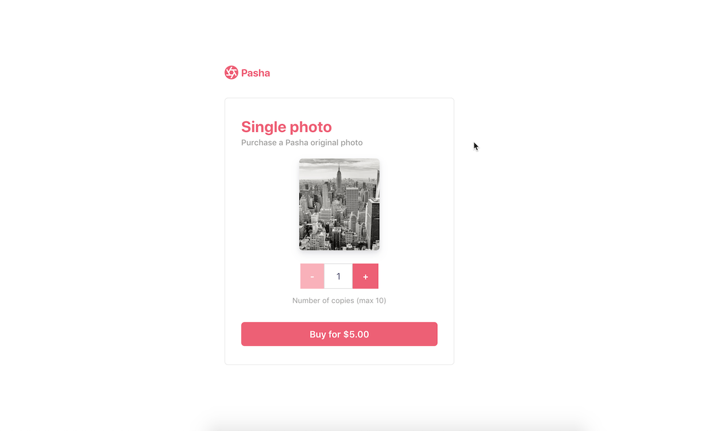

# Using Checkout for one-time purchases
Building payment form UI from scratch is difficult -- input field validation, error message handing, and localization are just a few things to think about when designing a simple checkout flow.

We built [Checkout](https://stripe.com/docs/payments/checkout) to do that work for you so now you can focus on building the best storefront experience for your customers.

Once your customer is ready to pay, use Stripe.js to redirect them to the URL of your Stripe hosted payment page. It's so simple you don't even need a server! 🥳



**Features:**
* Localization in 14 different languages 🌍
* Built-in Apple Pay support 🍎
* Built-in dynamic 3D Secure (ready for SCA) 🔔
* Plans to support more payment methods 🔮

For more features see the [Checkout documentation](https://stripe.com/docs/payments/checkout). 

There are two integrations: [client-only](./client-only) and [client-and-server](./client-and-server).
<!-- prettier-ignore -->
|     | client-only | client-and-server
:--- | :---: | :---:
🔨 **Prebuilt checkout page.** Create a payment page that is customizable with your business' name and logo. | ✅  | ✅ |
🔢 **Dynamic checkout amounts.** Dynamically define product amounts rather than relying on predefined SKUs.  | ❌  | ✅ |
⌛ **Capture payments later.** Optionally split the capture and authorization steps to place a hold on the card and charge later. | ❌ | ✅ |

## How to run locally
This recipe includes [5 server implementations](server/README.md) in our most popular languages. 

If you want to run the recipe locally, copy the .env.example file to your own .env file in this directory: 

```
cp .env.example .env
```

You will need a Stripe account with its own set of [API keys](https://stripe.com/docs/development#api-keys).

## FAQ
Q: Why did you pick these frameworks?

A: We chose the most minimal framework to convey the key Stripe calls and concepts you need to understand. These demos are meant as an educational tool that helps you roadmap how to integrate Stripe within your own system independent of the framework.

Q: Can you show me how to build X?

A: We are always looking for new recipe ideas, please email dev-samples@stripe.com with your suggestion!

## Author(s)
[@adreyfus-stripe](https://twitter.com/adrind)
