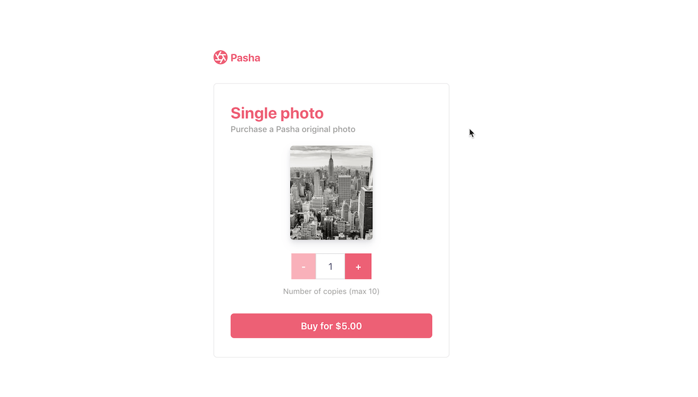

# Accept payments with Stripe Checkout

This sample shows you how to integrate with Stripe [Checkout](https://stripe.com/docs/checkout).

Building a payment form UI from scratch is difficult -- input field validation, error message handing, and localization are just a few things to think about when designing a simple checkout flow.

We built [Checkout](https://stripe.com/docs/payments/checkout) to do that work for you so now you can focus on building the best storefront experience for your customers.

Once your customer is ready to pay, use [Stripe.js](https://github.com/stripe/stripe-js) to redirect them to the URL of your Stripe hosted payment page. 🥳

## Demo

- [Live demo](https://checkout.stripe.dev/)

The demo is running in test mode -- use `4242424242424242` as a test card number with any CVC + future expiration date.

Use the `4000002500003155` test card number to trigger a 3D Secure challenge flow.

Read more about testing on Stripe at https://stripe.com/docs/testing.

<details open><summary>USD Cards Demo</summary>

</details>

<details><summary>EUR Cards & iDEAL Demo</summary>

</details>

<details><summary>MYR Cards & FPX Demo</summary>

</details>

## Features

- 🌍 Localization in different languages
- 🍎⌚️ Built-in support for Apple Pay and Google Pay
- 🔒 Built-in dynamic 3D Secure (ready for SCA)
- 🧾💵 Support for various payment methods. See the [docs](https://stripe.com/docs/payments/checkout/payment-methods) for details.
- 🍨 HTML + Vanilla JavaScript as well as ⚛️ React clients

For more features see the [Checkout documentation](https://stripe.com/docs/payments/checkout).


<!-- prettier-ignore -->
|     | ✅
:--- | :---:
🔨 **Prebuilt checkout page.** Create a payment page that is customizable with your business' name and logo. |  ✅ |
🔢 **Dynamic checkout amounts.** Dynamically define product amounts rather than relying on predefined Prices.   | ✅ |
⌛ **Capture payments later.** Optionally split the capture and authorization steps to place a hold on the card and charge later. | ✅ |


## How to run locally

This sample includes 8 server implementations in Java, JavaScript (Node), PHP, PHP-Slim, Python, Ruby, .NET, and Go. All servers implement the same routes for the client to communicate with. There is a HTML + Vanilla JavaScript as well as a React client implemention available.

Follow the steps below to run locally.

**1. Clone and configure the sample**

The Stripe CLI is the fastest way to clone and configure a sample to run locally.

**Using the Stripe CLI**

If you haven't already installed the CLI, follow the [installation steps](https://stripe.com/docs/stripe-cli#install). The CLI is useful for cloning samples and locally testing webhooks and Stripe integrations.

In your terminal, run the Stripe CLI command to clone the sample:

```
stripe samples create checkout-one-time-payments
```

The CLI will walk you through picking your integration type, server and client languages, and configuring your `.env` config file with your Stripe API keys.

**Installing and cloning manually**

If you do not want to use the Stripe CLI, you can manually clone and configure the sample yourself:

```
git clone https://github.com/stripe-samples/checkout-one-time-payments
```

Copy the .env.example file into a file named .env in the folder of the server you want to use. For example:

```
cp .env.example server/node/.env
```

You will need a Stripe account in order to run the demo. Once you set up your account, go to the Stripe [developer dashboard](https://stripe.com/docs/development#api-keys) to find your API keys.

```
STRIPE_PUBLISHABLE_KEY=<replace-with-your-publishable-key>
STRIPE_SECRET_KEY=<replace-with-your-secret-key>
```

The other environment variables are configurable:

`STATIC_DIR` tells the server where to the client files are located and does not need to be modified unless you move the server files.

`DOMAIN` is the domain of your website, where Checkout will redirect back to after the customer completes the payment on the Checkout page.

**2. Create a Price**

[](https://shields.io/)


You can create Products and Prices in the Dashboard or with the API. This sample requires a Price to run. Once you've created a Price, and add its ID to your `.env`.

`PRICE` is the ID of a [Price](https://stripe.com/docs/api/prices/create) for your product. A Price has a unit amount and currency.


You can quickly create a Price with the Stripe CLI like so:

```sh
stripe prices create --unit-amount 500 --currency usd -d "product_data[name]=demo"
```

<details>
<summary>With Stripe Tax</summary>
  Stripe Tax lets you calculate and collect sales tax, VAT and GST with one line of code.

  Before creating a price, make sure you have Stripe Tax set up in the dashboard: [Docs - Set up Stripe Tax](https://stripe.com/docs/tax/set-up).

  Stripe needs to know what kind of product you are selling to calculate the taxes. For this example we will submit a tax code describing what kind of product is used: `txcd_10000000` which is 'General - Electronically Supplied Services'. You can find a list of all tax codes here: [Available tax codes](https://stripe.com/docs/tax/tax-codes). If you leave the tax code empty, Stripe will use the default one from your [Tax settings](https://dashboard.stripe.com/test/settings/tax).

  ```sh
  stripe products create \
    --name="demo" \
    --tax-code="txcd_10000000"
  ```

  From the response, copy the `id` and create a price. The tax behavior can be either `inclusive` or `exclusive`. For our example, we are using `exclusive`.

  ```sh
  stripe prices create \
    --unit-amount=500 \
    --currency=usd \
    --tax-behavior=exclusive \
    --product=<INSERT_ID, like prod_ABC123>
  ```

  More Information: [Docs - Update your Products and Prices](https://stripe.com/docs/tax/checkout#product-and-price-setup)
</details>

Which will return the json:

```json
{
  "id": "price_1Hh1ZeCZ6qsJgndJaX9fauRl",
  "object": "price",
  "active": true,
  "billing_scheme": "per_unit",
  "created": 1603841250,
  "currency": "usd",
  "livemode": false,
  "lookup_key": null,
  "metadata": {
  },
  "nickname": null,
  "product": "prod_IHalmba0p05ZKD",
  "recurring": null,
  "tiers_mode": null,
  "transform_quantity": null,
  "type": "one_time",
  "unit_amount": 500,
  "unit_amount_decimal": "500"
}
```

Take the Price ID, in the example case `price_1Hh1ZeCZ6qsJgndJaX9fauRl`, and set the environment variable in `.env`:

```sh
PRICE=price_1Hh1ZeCZ6qsJgndJaX9fauRl
```

**3. Follow the server instructions on how to run**

Pick the server language you want and follow the instructions in the server folder README on how to run.

For example, if you want to run the Node server:

```
cd server/node 
# There's a README in this folder with instructions to run the server and how to enable Stripe Tax.
npm install
npm start
```

If you're running the react client, then the sample will run in the browser at
`localhost:3000` otherwise visit `localhost:4242`.


**4. [Optional] Run a webhook locally**

You can use the Stripe CLI to easily spin up a local webhook.

First [install the CLI](https://stripe.com/docs/stripe-cli) and [link your Stripe account](https://stripe.com/docs/stripe-cli#link-account).

```
stripe listen --forward-to localhost:4242/webhook
```

The CLI will print a webhook secret key to the console. Set `STRIPE_WEBHOOK_SECRET` to this value in your `.env` file.

You should see events logged in the console where the CLI is running.

When you are ready to create a live webhook endpoint, follow our guide in the docs on [configuring a webhook endpoint in the dashboard](https://stripe.com/docs/webhooks/setup#configure-webhook-settings).

## FAQ

Q: Why did you pick these frameworks?

A: We chose the most minimal framework to convey the key Stripe calls and concepts you need to understand. These demos are meant as an educational tool that helps you roadmap how to integrate Stripe within your own system independent of the framework.

Q: What happened to Plans and SKUs?

A: Plans and SKUs were old ways to model recurring and one-off prices. We created the Prices API to unify the two concepts and make it easier to reason about your pricing catalog. You can still pass old Plan and SKU IDs to Checkout -- to learn more read [our docs](https://stripe.com/docs/payments/checkout/migrating-prices) but know that you do not need to migrate any of your existing SKUs and Plans.

## Get support
If you found a bug or want to suggest a new [feature/use case/sample], please [file an issue](../../issues).

If you have questions, comments, or need help with code, we're here to help:
- on [Discord](https://stripe.com/go/developer-chat)
- on Twitter at [@StripeDev](https://twitter.com/StripeDev)
- on Stack Overflow at the [stripe-payments](https://stackoverflow.com/tags/stripe-payments/info) tag
- by [email](mailto:support+github@stripe.com)

Sign up to [stay updated with developer news](https://go.stripe.global/dev-digest).

## Author(s)

- [@adreyfus-stripe](https://twitter.com/adrind)
- [@thorsten-stripe](https://twitter.com/thorwebdev)
- [@cjavilla-stripe](https://twitter.com/cjav_dev)
